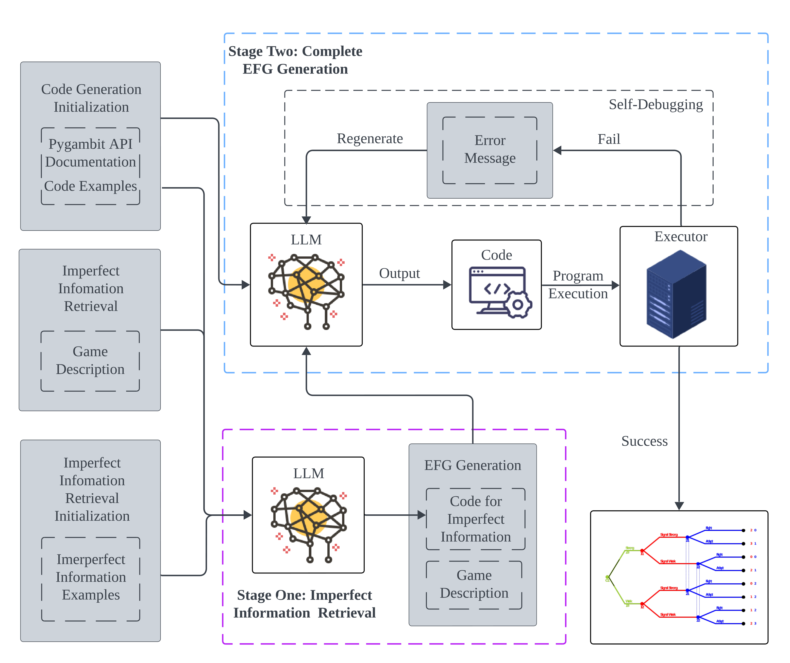

# GameInterpreter
We introduce a framework for translating game descriptions in natural language into game-theoretic extensive-form representations, leveraging Large Language Models (LLMs) and in-context learning. We find that a naive application of in-context learning struggles on this problem, in particular with imperfect information. 

To address this, we introduce GameInterpreter, a two-stage framework with specialized modules to enhance in-context learning, enabling it to divide and conquer the problem effectively. In the first stage, we tackle the challenge of imperfect information by developing a module that identifies information sets and the corresponding partial tree structure.  With this information, the second stage leverages in-context learning alongside a self-debugging module to produce a complete extensive-form game tree represented using pygambit, the Python API of a recognized game-theoretic analysis tool called Gambit. Using this python representation enables the automation of tasks such as computing Nash equilibria directly from natural language descriptions. 
